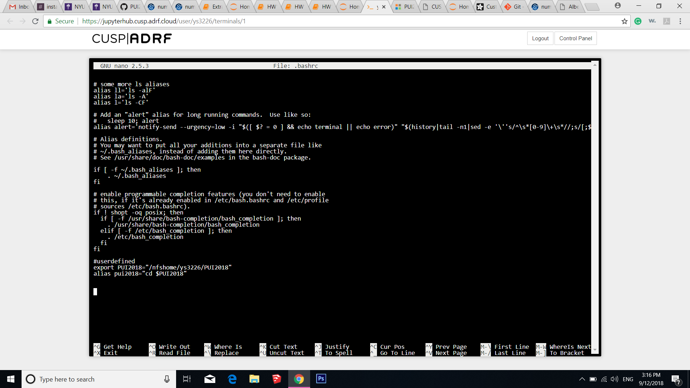
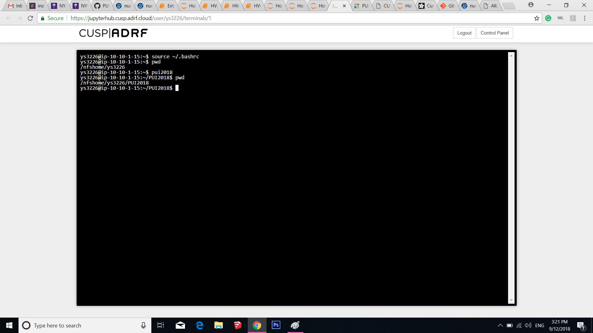

# This is a markdown file describing you how to set up an environment variable and alias using bash command line.

## 1 Create a PUI2018 directory
```
mkdir PUI2018
```

## 2 Open the bashrc to make any changes permenant. 
```
nano .bashrc
```

## 3 Use 'export' command to create an environmental variable and 'alias' command to create   
```
export PUI2018="/nfshome/ys3226/PUI2018"
alias pui2018="cd $PUI2018"
```


## 4 To save all these changes press CTRL+X and exit

## 5 Now, get out of bashrc and check whether our variable and alias are created
```
pwd
pui2018
pwd
```


So, everthing's seems fine. Welldone! 
Change the file