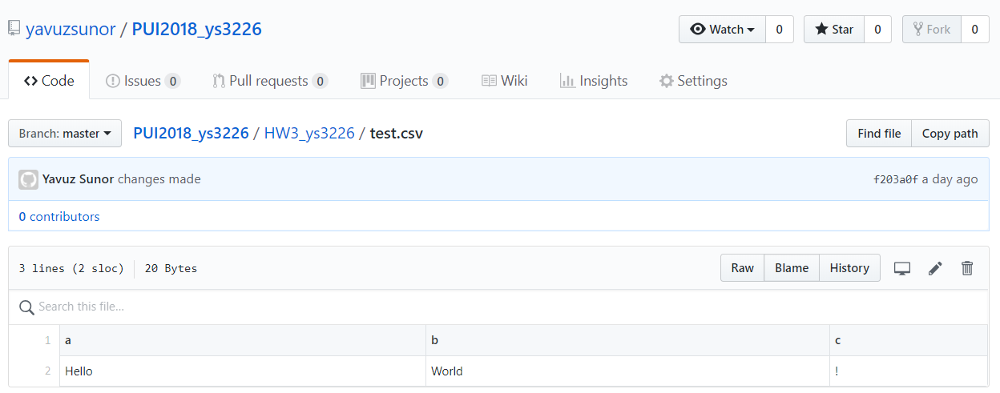
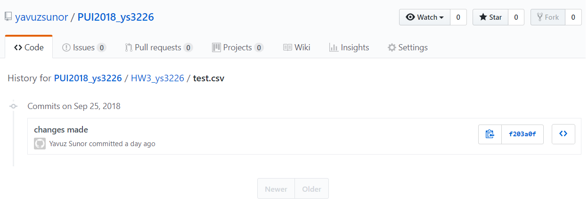
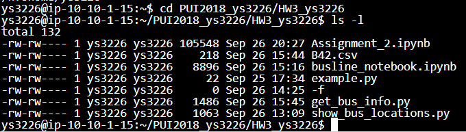
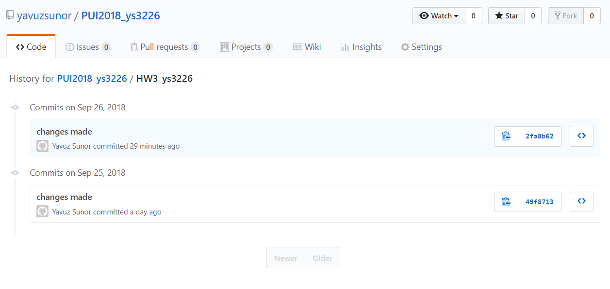
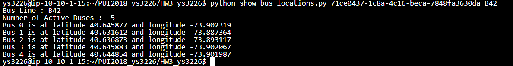

# This is a markdown file written by Yavuz Sunor describing PUI2018 Homework3 step by step with complementary screenshot. 

## Assignment_1_1 Create a text.csv file and push it to github

## Assignment_1_2 Then remove it from the local directory using the permanent deletion code and push the change also in github. 

## Assignment_2 Choose an open data from NYC Open Data and make some manipulations and visualizations on it using Jupyter Notebook
I chose Citibike data.
Then created the PUIDATA directory and also PUIDATA environmental variable in my local.
Using PUIDATA environmental variable I read the dataset and did data manipulations and visualization.
At the end, I also used a dataset with json format and read it pd.read_json.(I had to change the dataset to find an API subjected dataset - citybike was not)  

## Assignment_3 Write a python notebook in which you take two environmental variable(Bus APIKey and a BusLine) and come up with a list of locations for chosen BusLine
The file name : show_bus_locations.py
In order to do this, I had to understand the json format to do that. I got the notion of its nested and listed structure. And I was able to manage it using array-kind element operations. (i.e [][][][])

## Assignment_4 Write a python notebook in which you take three environmental variable(Bus APIKey, a BusLine and a CSV file in which to be written) and come up with a csv file that shows the next stop and status of chosen BusLine
The file name : get_bus_info.py
In order to do this, I had to figure out two things: 
(1)Writing into a csv file using fout.write command. 
(2)Using try and except command to assign N/A value for vehicles having no info. 
At this point of the Homework I worked with Tiffany Patafio and inspired by her approach of using fout.write and try-except Block. 