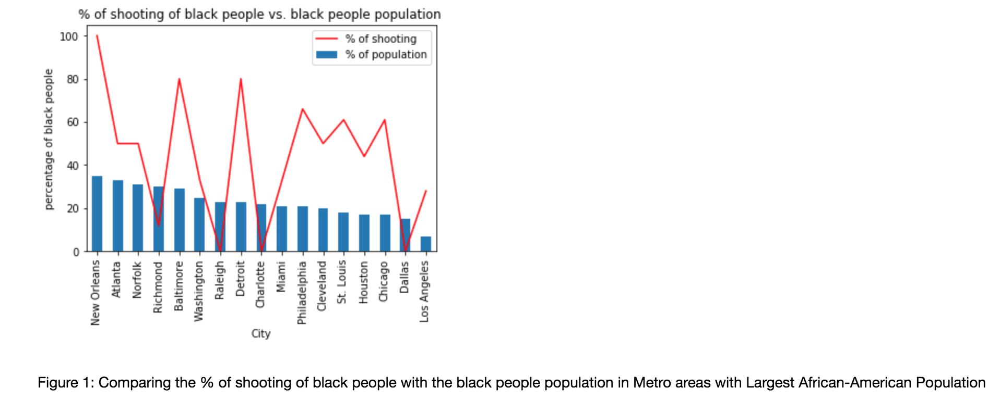

# This is a markdown file to describe PUI2018 Homework8 for each assignment. 

## Assignment 1 
I created a plot to understand the bias of police shootings through black people.

As a result of the plot, I couldn't see a distinct pattern(correlation) between % of police shooting involving black people and the black population in the corresponding Metro areas of 20 major cities.

## Assignment 2
We tested the difference in bike usage distributions between subscribers and customers(two different usertype).
In conclusion, our Hyphothesis saying that subscribers use citibike for their commute more than customers in terms of percentage has been verified.
According to the peer reviews we both have, we applied z-score test for our citibike project. Some revies were pretty constructive. We changed our Null Hypothesis and some wordings. We also aggregated our hourly distributions into a two category distributions. (Peak hour and Non Peak hour) 

The link of our Authorea Project report : https://www.authorea.com/336155/rOox22yU649EHGNhc21NKw

### We worked together with Max W Brueckner-Humphreys for the Assignment 2(citibike).