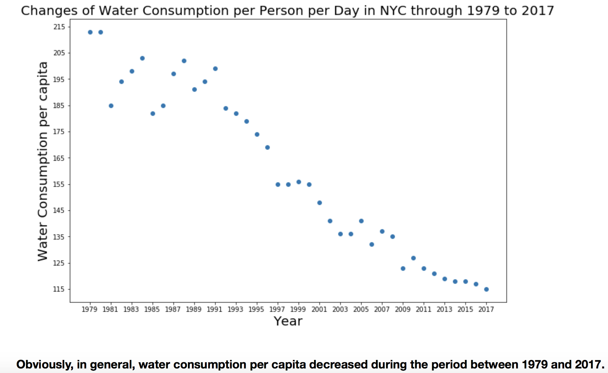

### My plot review for sg5718

The plot is generally clear. The labels(x and y)are well defined. Here, the title could have been more explanatory by giving the water consumption type(drinking or washing for example). The size of the fonts are proper which makes reading easy.  

The selected color for data points is good for any eye. Altough the scatter-plot does not change or confuse the meaning here, I would use a line-plot to make the reading easier for each year. Besides that, y-label could have a unit (liter, oz or gal)

Overall, the plot gives the story without deforming it. It can be slightly updated with emphasizing the above-mentioned points. 