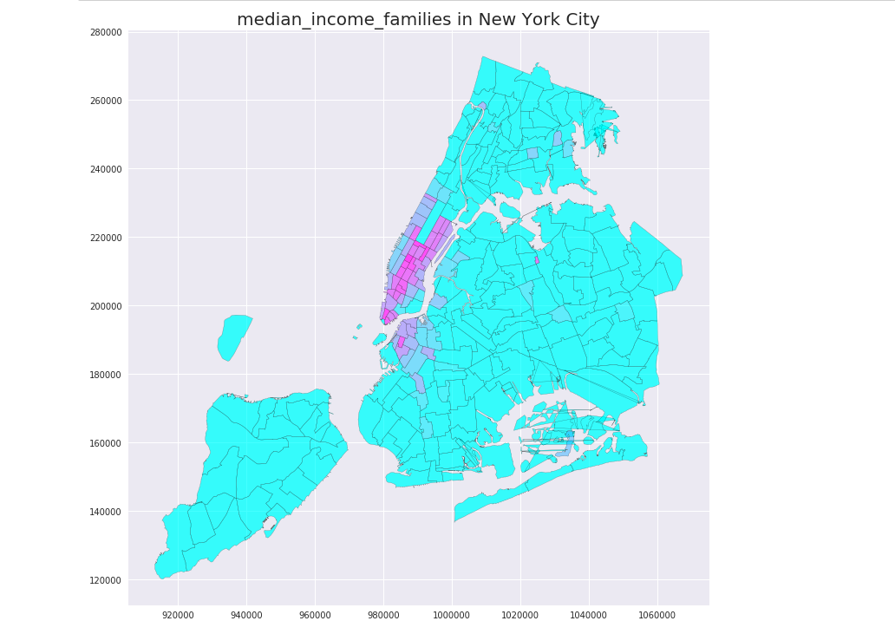

### My plot review for yc3763

The plot is visually clear. However, the labels(x and y) could have been better defined. Apperantly, they are not langitudes and latitudes. And this makes the interpretation a bit difficult. Here, the title could have been more explanatory by giving the exact meaning of median income families. It may create a confusion between median income of households, individuals or families. Also, a colormap and a unit for the median income would be great. It's a bit diffucult to understand which color represents which scale or level. The size of the fonts are proper which makes reading easy.  

The selected color for polygons is good for any eye. The scale of the map is rational and represents well the real New York area. The borders among zones are marked well and readable. However, there is a shortage in terms of the quantities on the map like mentioned above.(both for labels and the median income levels)   

Overall, the plot represents New York well, but the message could be more clear by giving the exact x-y labels, colormaps with scales and units, and finally a more thorough title.